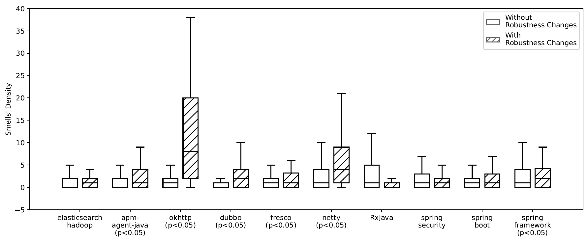

# Don't Forget the Exception! 
## Considering Robustness Changes to Identify Design Problems
## MSR '23
Complementary Material for the paper Don't Forget the Exception! Considering Robustness Changes to Identify Design Problems

<hr>

## Smells Collected

### Maintainability Smells
#### Brain Method
  Long and complex method that centralizes the intelligence of a class
#### Dispersed Coupling
  A method that accesses many elements, and the accessed code elements are dispersed among many classes
#### Feature Envy
  A method that is more interested in a class other than the one it actually is in
#### Intensive Coupling
  A method that has tight coupling with other methods, and these coupled methods are defined in the context of few classes
#### Long Method
  A method that is unduly long in terms of lines of code
#### Message Chain
  A long chain of method invocations is performed to implement a class functionality
#### Long Parameter List
  A method having a long list of parameters, some of which avoidable
#### Shotgun Surgery
  When a single change performed on the method demands multiple other changes on other classes  

<br/>

### Robustness Smells
In parenthesis we show the smell name present in PMD.

#### Catch Generic Exception (AvoidCatchingGenericException)
  A method that catches generic exceptions such as NullPointerException, RuntimeException, and Exception in try-catch block

#### Method Throws Exception (SignatureDeclareThrowsException)
  A method that explicitly throw java.lang.Exception

#### Empty Catch Block (EmptyCatchBlock)
  An exception is caught, but nothing is done

#### Catch NPE (AvoidCatchingNPE)
  Code throwing NullPointerExceptions

#### Rethrows Exception (AvoidRethrowingException)
  Catch blocks that rethrow a caught exception

#### Throw New Instance of Same Exception (AvoidThrowingNewInstanceOfSameException)
  Catch blocks that rethrow a caught exception wrapped inside a new instance of the same type

#### Throw Exception in Finally (DoNotThrowExceptionInFinally)
  Method throwing exceptions within a 'finally'

#### Exception as Flow Control (ExceptionAsFlowControl)
  Catches the use of exception statements as a flow control device

#### Throw NPE (AvoidThrowingNullPointerException)
  A method that throws a Null Pointer Exception


<hr>

## Python script to collect changes in the catch blocks

Our Python tool used to collect the robustness changes is available at https://github.com/robustnessdp/tool

<hr>

## RQ.1: How often do robustness changes co-occur with maintainability smells?

File [Analysis Protocol - RQ1.pdf](rq1/Analysis%20Protocol%20-%20RQ1.pdf) presents the protocol used in this analysis.

Folder [<code>/rq1</code>](rq1) contains the file rq1_analysis.xlsx with the analysis performed by the authors. 

Each row contains the 
  * Commit Hash
  * Project Name
  * Class Name 
  * Method Name
  * Notes: Filled by the authors with their analysis
  * TAGs: The authors divided the analyzed row into
    - ROBUSTNESS_RELATED: When the change was related to robustness
    - ROBUSTNESS_NOT_RELATED:  When the change was not related to robustness 
    - OTHER_NFR: When the change was related to other NFR (e.g. Security)
    - ROBUSTNESS_IMPROVEMENT: When there was a robustness improvement in the change
    - ROBUSTNESS_NOT_IMPROVEMENT: When there was no robustness improvement in the change

On [<code>/rq1/samples/</code>](rq1/samples) we present the <code>.json</code> files used by the authors to help them on the analysis. We have a file <code> sample_$project$.json </code> for each project.

On each file, the authors matched the commit hash from the <code>.xlsx</code> file with the hash on the <code>.json</code> file, identifying the smells affecting the method to be analyzed.
  
Following we have an example on the Netty Project, for the commit <code>"95652fef12"</code>.

In this file the author would use the mainly information from the field <code>"smells"</code>.
  
 ```yaml
   {
    "Netty": {
        "95652fef12": [
            {
                "className": "io.netty.channel.kqueue.KQueueDatagramChannel",
                "exceptionalChanges": [
                    {
                        "changedMethod": "KQueueDatagramChannel.doWrite",
                        "methodInfo": {
                            "parametersTypes": [
                                "ChannelOutboundBuffer"
                            ],
                            "sourceFile": {
                                "fileRelativePath": "transport-native-kqueue/src/main/java/io/netty/channel/kqueue/KQueueDatagramChannel.java"
                            },
                            "metricsValues": {
                                "ChangingMethods": 0.0,
                                "MaxCallChain": 2.0,
                                "CyclomaticComplexity": 8.0,
                                "NumberOfCatchStatements": 1.0,
                                "ParameterCount": 1.0,
                                "NumberOfFinallyStatements": 0.0,
                                "ThrownExceptionTypesCount": 1.0,
                                "NumberOfDummyExceptionHandlers": 0.0,
                                "NumberOfThrowStatements": 0.0,
                                "ExceptionalLOC": 21.0,
                                "MethodLinesOfCode": 21.0,
                                "NumberOfAccessedVariables": 6.0,
                                "NumberOfTryStatementsWithNoCatchAndFinally": 0.0,
                                "CouplingIntensity": 9.0,
                                "CouplingDispersion": 0.5555555555555556,
                                "NumberOfTryStatements": 1.0,
                                "ChangingClasses": 0.0,
                                "MaxNesting": 3.0
                            },
                            "fullyQualifiedName": "io.netty.channel.kqueue.KQueueDatagramChannel.doWrite",
                            "smells": [
                                {
                                    "name": "FeatureEnvy",
                                    "reason": "CALLS_TO_io.netty.channel.ChannelOutboundBuffer > 4",
                                    "startingLine": 246,
                                    "endingLine": 282
                                },
                                {
                                    "name": "DispersedCoupling",
                                    "reason": "CINT > 8.0, CDISP > 0.5, CC > 1.0",
                                    "startingLine": 246,
                                    "endingLine": 282
                                }
                            ],
                            "kind": "protected method"
                        }
                    }
   ...
  }
  
```

<hr>

## RQ.2: What impact can robustness changes have on the degradation of classes?

#### Density of maintainability smells in methods with and without robustness changes



#### Detailed statistics

*elasticsearch-hadoop*
| Statistics | With Exception | Without Exception |
| ---------- | -------------- | ----------------- |
| Minimum    | 0              | 0                 |
| Maximum    | 32             | 38                |
| Mean       | 2.9            | 2.6               |
| Median     | 1              | 0                 |
| Mode       | 0              | 0                 |
| Std. Dev.  | 5.2            | 4.5               |


*apm-agent-java*
| Statistics | With Exception | Without Exception |
| ---------- | -------------- | ----------------- |
| Minimum    | 0              | 0                 |
| Maximum    | 73             | 48                |
| Mean       | 3.2            | 2.3               |
| Median     | 1              | 1                 |
| Mode       | 0              | 0                 |
| Std. Dev.  | 7.5            | 6.7               |


*okhttp*
| Statistics | With Exception | Without Exception |
| ---------- | -------------- | ----------------- |
| Minimum    | 0              | 0                 |
| Maximum    | 197            | 181               |
| Mean       | 30.8           | 4.3               |
| Median     | 8              | 0                 |
| Mode       | 0              | 0                 |
| Std. Dev.  | 37.8           | 22.3              |


*dubbo*
| Statistics | With Exception | Without Exception |
| ---------- | -------------- | ----------------- |
| Minimum    | 0              | 0                 |
| Maximum    | 38             | 17                |
| Mean       | 4.7            | 0.8               |
| Median     | 3              | 0                 |
| Mode       | 0              | 0                 |
| Std. Dev.  | 6.6            | 3.2               |


*fresco*
| Statistics  | With Exception | Without Exception |
|---|-------|-------|
| Minimum | 0 | 0 |
| Maximum | 27 | 30 |
| Mean | 3.29 | 1.57 |
| Median | 1.00 | 1.00 |
| Mode | 0.00 | 0.00 |
| Std. Dev. | 5.25 | 2.91 |


*netty*
| Statistics  | With Exception | Without Exception |
|---|-------|-------|
| Minimum | 0 | 0 |
| Maximum | 113 | 157 |
| Mean | 8.72 | 3.74 |
| Median | 4.00 | 1.00 |
| Mode | 0.00 | 0.00 |
| Std. Dev. | 16.39 | 8.19 |


*rxjava*
| Statistics  | With Exception | Without Exception |
|---|-------|-------|
| Minimum | 0 | 0 |
| Maximum | 86 | 244 |
| Mean | 3.53 | 5.58 |
| Median | 1.00 | 1.00 |
| Mode | 0.00 | 0.00 |
| Std. Dev. | 12.52 | 13.23 |


*spring-security*
 | Statistics  | With Exception | Without Exception |
|---|-------|-------|
| Minimum | 0 | 0 |
| Maximum | 27 | 71 |
| Mean | 2.27 | 2.34 |
| Median | 1.00 | 1.00 |
| Mode | 0.00 | 0.00 |
| Std. Dev. | 4.28 | 4.96 |


*spring-boot*
| Statistics  | With Exception | Without Exception |
|---|-------|-------|
| Minimum | 0 | 0 |
| Maximum | 45 | 56 |
| Mean | 3.39 | 2.63 |
| Median | 1.00 | 1.00 |
| Mode | 0.00 | 0.00 |
| Std. Dev. | 7.78 | 5.97 |


*spring-framework*
| Statistics  | With Exception | Without Exception |
|---|-------|-------|
| Minimum | 0 | 0 |
| Maximum | 23 | 132 |
| Mean | 3.41 | 3.89 |
| Median | 2.00 | 1.00 |
| Mode | 0.00 | 0.00 |
| Std. Dev. | 4.08 | 9.25 |


### Analysis Insertion of Maintainability Smells

File [Protocol Analysis Smell Insertion.pdf](rq2/Protocol%20Analysis%20Smell%20Insertion.pdf) presents the protocol used in this analysis.

File [rq2_analysis.xlsx](rq2/rq2_analysis.xlsx) has the  the analysis performed by the authors. 

Each row contains the 
  * Project Name
  * Commit hash
  * Method Name
  * Number of smells inserted in the commit
  * Cause: Filled by the authors with their analysis
  
<hr>

## RQ.3: How do robustness smells give evidence of design problems?
File [Protocolo - Analysis Patterns of Smells.pdf](rq3/Protocolo%20-%20Analysis%20Patterns%20of%20Smells.pdf) presents the protocol used in this analysis.

File [Patterns Validation.xlsx](rq3/Patterns%20Validation.xlsx) has the  the analysis performed by the authors. 

Each row contains the 
  * Project Name
  * Commit hash
  * Commit URL
  * Method Name
  * Pattern present in the method
  * Maintainability smells affecting the method
  * Robustness smells affecting the method
  * Cause: Filled by the authors with their analysis
